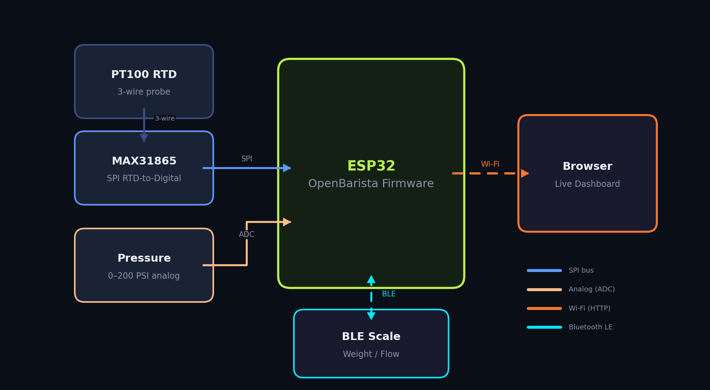

# OpenBarista

**Open-source ESP32 espresso telemetry firmware written in Rust.**

OpenBarista turns an ESP32 into a real-time espresso monitoring station. It reads brew temperature, brew pressure, and (optionally) extraction weight from a Bluetooth scale — then serves a live dashboard directly from the device over Wi-Fi.

No cloud. No app. Just your espresso machine and a browser.

---

## What It Does

| Metric | Sensor | Interface |
|---|---|---|
| **Brew temperature** | PT100 RTD via MAX31865 | SPI |
| **Brew pressure** | 0–200 PSI analog transducer | ADC |
| **Extraction weight** | BLE-compatible coffee scale | Bluetooth LE |
| **Flow rate** | Derived from weight over time | Calculated |

All telemetry is displayed on a live web dashboard served by the ESP32 itself — no external server required.

---

## Quick Links

- [**Hardware & Components**]({{ site.baseurl }}/hardware/) — What you need to buy
- [**Wiring Guide**]({{ site.baseurl }}/wiring/) — How to connect everything
- [**Toolchain Setup**]({{ site.baseurl }}/setup/) — Installing the Rust + ESP-IDF build environment
- [**Building & Flashing**]({{ site.baseurl }}/flashing/) — Compiling and loading firmware
- [**Web Dashboard**]({{ site.baseurl }}/dashboard/) — Using the on-device UI
- [**Bluetooth Scale**]({{ site.baseurl }}/scale/) — Pairing and using a BLE scale

---

## How It Works

At boot the firmware:

1. Initializes sensors and BLE scale support
2. Tries saved Wi-Fi credentials — falls back to a captive-portal setup AP if needed
3. Starts an HTTP server on the local network
4. Enters a 50 ms sampling loop, continuously updating telemetry

---

## Project Status

OpenBarista is firmware-first. It currently includes:

- Temperature + pressure sampling loop
- BLE scale scanning, pairing, live weight and flow telemetry
- Shared in-memory telemetry feed
- Wi-Fi provisioning with captive portal fallback
- Station-mode dashboard and settings pages
- Persistent Wi-Fi and device settings in ESP NVS
- Build metadata and stable board identity

No desktop app or cloud backend is required.

---

## License

OpenBarista is open source. See [LICENSE](https://github.com/mrusse/OpenBarista/blob/main/LICENSE) in the repository.
