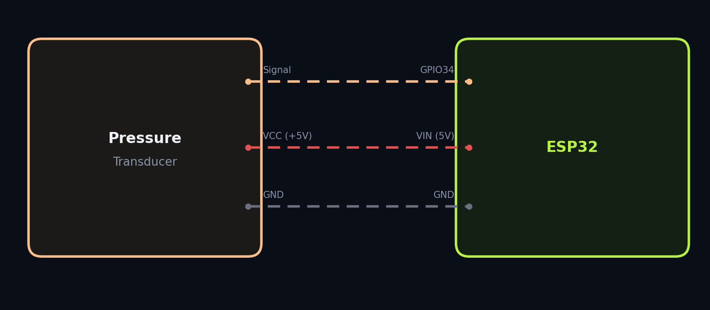
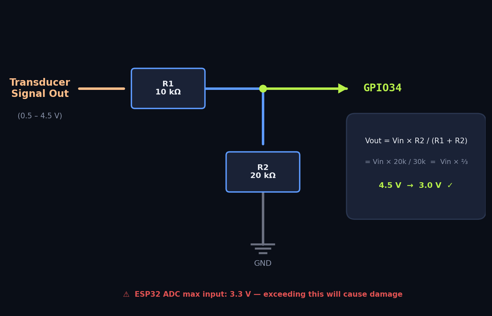

# Wiring Guide

How to connect the sensors to your ESP32.

---

## Pin Summary

| ESP32 Pin | Function | Connected To |
|---|---|---|
| **GPIO5** | SPI CS (Chip Select) | MAX31865 CS |
| **GPIO18** | SPI SCLK (Clock) | MAX31865 CLK |
| **GPIO23** | SPI MOSI (Data Out) | MAX31865 SDI |
| **GPIO19** | SPI MISO (Data In) | MAX31865 SDO |
| **GPIO34** | ADC1 (analog input) | Pressure transducer signal |
| **3.3V** | Power | MAX31865 VIN |
| **GND** | Ground | MAX31865 GND, Transducer GND |
| **VIN** | 5V | Pressure transducer VCC |

---

## Temperature: PT100 + MAX31865

### MAX31865 Board Connections

| MAX31865 Pin | ESP32 Pin | Wire Color (suggested) |
|---|---|---|
| VIN | 3.3V | Red |
| GND | GND | Black |
| CLK | GPIO18 | Yellow |
| SDI | GPIO23 | Blue |
| SDO | GPIO19 | Green |
| CS | GPIO5 | Orange |

### PT100 RTD to MAX31865

For a **3-wire PT100** (the most common configuration):

| RTD Wire | MAX31865 Terminal |
|---|---|
| Wire 1 (usually red) | RTD+ |
| Wire 2 (usually red) | RTD+ (bridged) |
| Wire 3 (usually white) | RTD− |

**3-wire jumper:** Make sure the 3-wire configuration jumper/solder bridge on your MAX31865 board is set correctly. On the Adafruit board, cut the 2/4-wire trace and bridge the 3-wire pads.

### SPI Configuration

OpenBarista uses **SPI Mode 1** at **1 MHz**:

- CPOL = 0, CPHA = 1
- Clock: 1 MHz
- Reference resistor: 430 Ω (standard for PT100)
- Nominal resistance: 100 Ω

---

## Pressure: Analog Transducer

### Basic Connection



### Voltage Divider (if needed)

Many 0–200 PSI transducers output **0.5–4.5 V**. The ESP32 ADC is only safe up to **3.3 V**.

If your transducer can output above 3.3 V at your operating pressure range, add a voltage divider:



This divides the signal by 3 (ratio: R2 / (R1 + R2) = 2/3), bringing 4.5 V down to 3.0 V.

**If your machine operates well below the transducer's full range** (e.g., 0–12 bar on a 0–200 PSI sensor), the output voltage at your max brew pressure may already be under 3.3 V. In that case, you can connect directly. Do the math first:

```
voltage = 0.35 + (pressure_psi / 200) × (4.5 − 0.35)
```

At 12 bar (~174 PSI):
```
voltage = 0.35 + (174/200) × 4.15 ≈ 3.96 V   ← too high, use a divider
```

At 9 bar (~130 PSI):
```
voltage = 0.35 + (130/200) × 4.15 ≈ 3.05 V   ← safe for direct connection
```

**⚠️ When in doubt, use the voltage divider. Exceeding 3.3 V will damage the ESP32.**

### ADC Configuration

- Pin: GPIO34 (ADC1, read-only pin — no internal pull-up)
- Attenuation: 12 dB (full 0–3.3 V range)
- Resolution: 12-bit (0–4095 counts)

---

## Bluetooth Scale

No wiring needed — the scale connects wirelessly over BLE.

See the [Bluetooth Scale]({{ site.baseurl }}/scale/) page for pairing instructions.

---

## Tips

- **Keep SPI wires short.** Long wires between the ESP32 and MAX31865 can introduce noise. Under 15 cm is ideal.
- **Decoupling caps.** A 100 nF ceramic capacitor between VIN and GND on the MAX31865 board helps with noisy power lines.
- **Star ground.** Connect all GND wires to a single point on the ESP32 GND pin to avoid ground loops.
- **Shielding.** If you're mounting near the machine's boiler or pump, consider shielded cable for the SPI and analog lines.
- **Secure connections.** Espresso machines vibrate. Solder joints or screw terminals are more reliable than breadboard connections for permanent installs.
